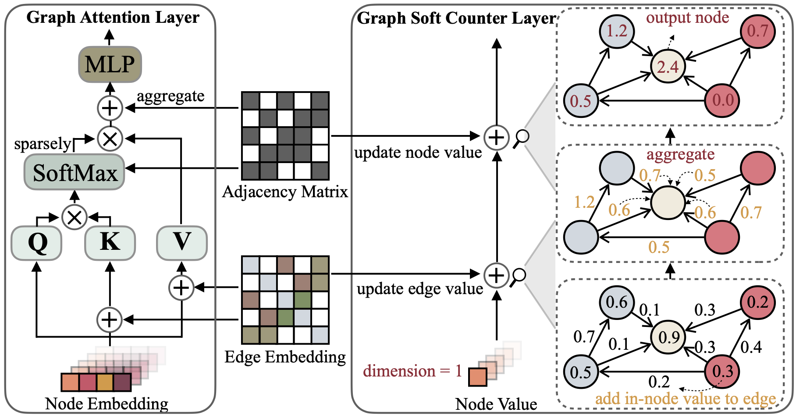

# Graph Soft Counter
The anonymous opensource code of the paper: [GNN is a Counter? Revisiting GNN for Question Answering](https://openreview.net/pdf?id=hzmQ4wOnSb).

<p align="center">
  
</p>


## Environment 
You can just run the bash file 'setup.sh' or run the following commands to create a conda environment:
```bash
conda create -n gsc python=3.8
source activate gsc
conda install pytorch torchvision torchaudio cudatoolkit=10.2 -c pytorch
conda install pyg -c pyg
conda install transformers


```

### Dataset
We use the question answering datasets (*CommonsenseQA*, *OpenBookQA*) and the ConceptNet knowledge graph. We process the dataset following [QA-GNN](https://github.com/michiyasunaga/qagnn), and the preprocessing may take long. For your convenience, you can download all the processed data by
```
./download_preprocessed_data.sh
```

The resulting file structure will look like:

```plain
.
├── README.md
├── data/
    ├── cpnet/                 (prerocessed ConceptNet)
    ├── csqa/
        ├── train_rand_split.jsonl
        ├── dev_rand_split.jsonl
        ├── test_rand_split_no_answers.jsonl
        ├── statement/             (converted statements)
        ├── grounded/              (grounded entities)
        ├── graphs/                (extracted subgraphs)
        ├── ...
    └── obqa/
```

### 2. Train GSC
For CommonsenseQA, run
```
./run_gsc__csqa.sh
```
For OpenBookQA, run
```
./run_gsc__obqa.sh
```
As configured in these scripts, the model needs two types of input files
* `--{train,dev,test}_statements`: preprocessed question statements in jsonl format. This is mainly loaded by `load_input_tensors` function in `utils/data_utils.py`.
* `--{train,dev,test}_adj`: information of the KG subgraph extracted for each question. This is mainly loaded by `load_sparse_adj_data_with_contextnode` function in `utils/data_utils.py`.
load_sparse_adj_data_with_contextnode
**Note**: We find that training for OpenBookQA is unstable (e.g. best dev accuracy varies when using different seeds, different versions of the transformers / torch-geometric libraries, etc.), likely because the dataset is small. We suggest trying out different seeds. Another potential way to stabilize training is to initialize the model with one of the successful checkpoints provided below, e.g. by adding an argument `--load_model_path obqa_model.pt`.


### 3. Evaluate trained model
For CommonsenseQA, run
```
./eval_gsc__csqa.sh
```
For OpenBookQA, run
```
./eval_gsc__obqa.sh
```

## Trained model examples
CommonsenseQA
<table>
  <tr>
    <th>Trained model</th>
    <th>In-house Dev acc.</th>
    <th>In-house Test acc.</th>
  </tr>
  <tr>
    <th>RoBERTa-large + GSC <a href="https://drive.google.com/file/d/1W0khl1F6V_NSHdE1amuMeo9OKGKNQfrV/view?usp=sharing">[link]</a></th>
    <th>0.7969</th>
    <th>0.7478</th>
  </tr>
</table>

OpenBookQA
<table>
  <tr>
    <th>Trained model</th>
    <th>Dev acc.</th>
    <th>Test acc.</th>
  </tr>
  <tr>
    <th>RoBERTa-large + GSC <a href="https://drive.google.com/file/d/1-5orcKIP39UTCZ2wfYGEFIL1H3EmjvjV/view?usp=sharing">[link]</a></th>
    <th>0.6960</th>
    <th>0.7060</th>
  </tr>
</table>


**Note**: The models were trained and tested with HuggingFace transformers==2.0.1. 


## Acknowledgment
This repo is built upon the following works:
```
QA-GNN: Reasoning with Language Models and Knowledge Graphs for Question Answering. Michihiro Yasunaga and Hongyu Ren and Antoine Bosselut and Percy Liang and Jure Leskovec. NAACL 2021. 
https://github.com/michiyasunaga/qagnn

Scalable Multi-Hop Relational Reasoning for Knowledge-Aware Question Answering. Yanlin Feng*, Xinyue Chen*, Bill Yuchen Lin, Peifeng Wang, Jun Yan and Xiang Ren. EMNLP 2020. 
https://github.com/INK-USC/MHGRN

```
Many thanks to the authors and developers!
